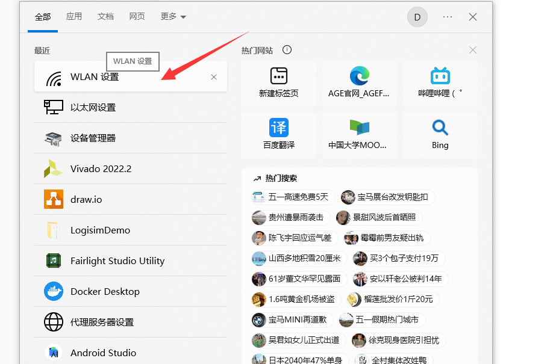
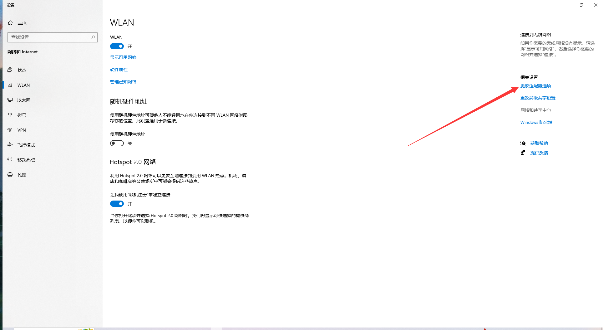
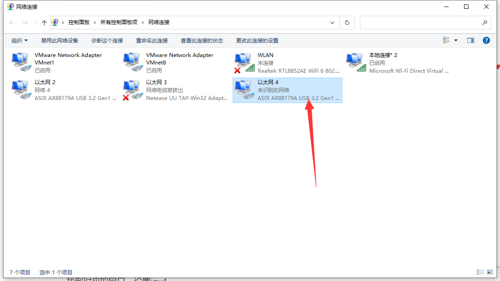
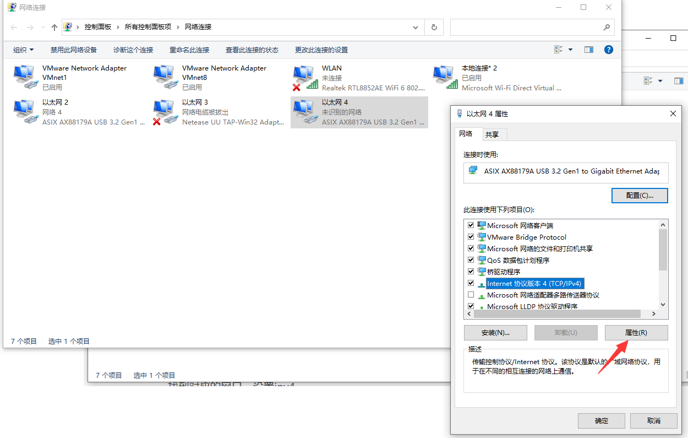
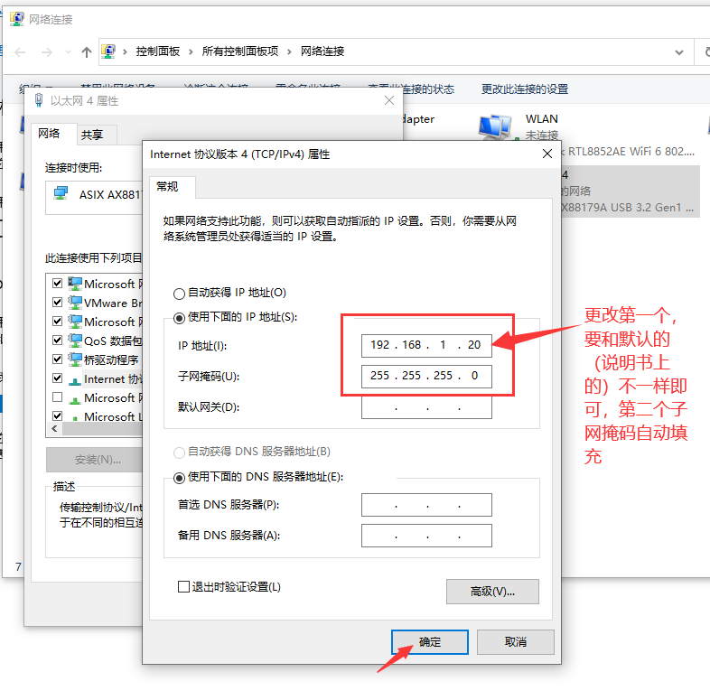
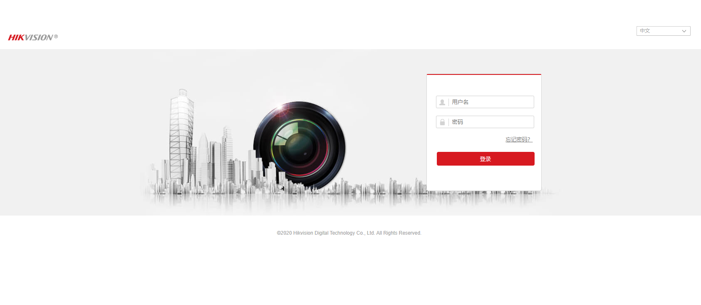

## 连接云台

把海康威视的云台的线接好了之后发现连接不上网络端的界面，检查供电接线均无问题；原来是要配置，配置方法如下：

找到对应的网口，设置ipv4

右键属性

设置完成后，直接访问说明书上的网址，用账户密码打开即可：

> 信息备注：我这里是
>
> - IP: 192.168.1.19
> - Username: admin
> - Password: abcd1234